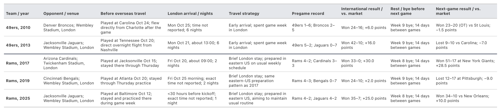

# Introduction

Long-haul travel presents two related challenges for athletes: travel
fatigue and jet lag. Travel fatigue arises from the demands of the
journey, including sleep disruption, prolonged immobility, and
interruptions to nutrition, hydration, and recovery routines
[@halson2019travel; @janse2021]. Jet lag results from misalignment
between the internal circadian clock and the environmental light–dark
cycle following rapid transmeridian travel [@janse2021]. The two can
coexist, but travel fatigue can occur even when few or no time zones are
crossed [@waterhouse2004travel]. Management recommendations therefore
address both recovery from the journey and circadian adjustment. Sleep
preservation, movement, nutrition, and hydration are recommended to help
manage travel fatigue, while jet-lag strategies include appropriately
timed light exposure, sleep scheduling, and, when appropriate, melatonin
[@forbesrobertson2012; @halson2019travel; @janse2021].

Although long-haul travel can disturb sleep and recovery, the extent to
which these disturbances affect athletic performance remains uncertain
[@botonis2025; @rossiter2022]. Studies differ substantially in travel
direction, number of time zones crossed, recovery time, sport, and
outcomes, complicating comparison of their findings [@benito2026;
@botonis2025; @rossiter2022]. In American football, related studies have
examined game timing and travel across time zones, using betting spreads
to compare actual game outcomes with expectations for each matchup.
National Football League (NFL) analyses of historical datasets reported
time-of-day associations with performance relative to betting-market
expectations [@smith1997; @smith2013]. However, a recent analysis of
6,245 collegiate games found no clear evidence of time-zone effects on
performance relative to the betting spread recorded the day before each
game [@tenan2025]. These studies examined domestic competition and did
not compare arrival schedules for intercontinental travel that imposes
potentially greater travel fatigue and jet lag.

Despite this uncertainty, teams must decide how far in advance of
competition to arrive [@hatamiya2026]. Earlier arrival provides
additional time for recovery and circadian adjustment, consistent with
athlete-travel guidance and evidence that sleep and some aspects of
performance can remain disturbed for several days after long-haul travel
[@janse2021; @botonis2025]. Alternatively, short-stay trips with later
arrival may aim to preserve typical routines leading up to travel and
minimize behavioral adjustment to destination time, particularly when
competition timing is compatible with an origin-based schedule
[@forbesrobertson2012; @janse2021]. Research in non-athlete travelers
provides some support for retaining home-based sleep schedules during
short stays, with reduced sleepiness and jet-lag symptoms [@lowden1998].
In principle, maintaining closer alignment with the origin time zone
could also reduce the need for readjustment on return home
[@forbesrobertson2012]. However, later arrival leaves less time for
recovery from travel fatigue and preparation in the competition setting
[@waterhouse2004travel]. The choice therefore depends on travel
direction, time zones crossed, trip duration, competition time, and
individual response, and current evidence does not establish an optimal
arrival interval before competition [@botonis2025].

Intriguingly, the San Francisco 49ers (49ers) and Los Angeles Rams
(Rams) provide recurring examples of these contrasting arrival
approaches. Before their 2010 and 2013 London games, the 49ers arrived
six nights before Sunday kickoff [@fucillo2013; @niners-touchdown2010].
By contrast, the Rams spent most of game week in the eastern United
States before their 2017, 2019, and 2025 London games. They arrived in
London two nights before kickoff in 2017 and 2019, and less than 30
hours before kickoff in 2025 [@rams-london2025; @rams-london2019;
@rams-london2017]. For their 2026 game in Melbourne, Australia, both
teams made transpacific journeys from California but arrived
approximately six days apart. The 49ers spent seven nights in Melbourne,
providing more time to recover from travel and adjust to local time
[@49ers-schedule2026; @niners-shanahan-sep2026; @tolliver2026melbourne],
whereas the Rams arrived approximately 28 hours before kickoff
[@williams2026melbourne], with the stated aim of preserving players’
usual routine and remaining close to Pacific time [@edwards2026rams;
@nfl-arrival2026]. This shared setting offered a more direct comparison
of arrival approaches than the teams’ separate London appearances.

This observational case study compared the 49ers’ and Rams’ performance
in the 2026 Melbourne game. We examined scoring margin, performance
relative to the closing spread, and play-by-play measures of offensive
and defensive performance. Selected previous international games in
which each franchise used a similar arrival approach provided historical
context. Each team’s first game after the Melbourne and historical trips
was also examined to describe post-travel performance. Although the
shared setting reduced variation in competition conditions, each arrival
approach was used by a different team. The analysis therefore describes
performance under contrasting schedules but cannot isolate the
contribution of arrival timing.

# Materials and Methods

## Study design and game selection

This study examined contrasting arrival schedules and game performance
of the 49ers and Rams surrounding their 2026 NFL game in Melbourne,
Australia. Travel schedules were reconstructed from publicly available
reports. The 49ers departed California on September 2, arrived in
Melbourne on the morning of September 4, and conducted game week
locally, spending seven nights in Melbourne before the game
[@nfl-arrival2026; @tolliver2026melbourne]. The Rams practiced in Los
Angeles through September 8, departed from California that night, and
arrived in Melbourne on the morning of September 10, approximately 28
hours before kickoff [@jackson2026practice; @klein2026;
@williams2026melbourne]. Kickoff was at 10:37 Australian Eastern
Standard Time on September 11, corresponding to 17:37 Pacific Daylight
Time on September 10 (@fig-melbourne-travel).

{#fig-melbourne-travel
fig-alt="Visual comparison of the 49ers and Rams 2026 Melbourne travel context. Both teams originated in Pacific time and shared the Melbourne Cricket Ground venue and kickoff. The 49ers arrived approximately seven days before kickoff and spent seven destination nights; the Rams arrived 28 hours before kickoff and spent one destination night. The Rams were favored by 3.5 points, and the 49ers won 27 to 7 for a positive 23.5-point market residual."
width="100%"}

Historical regular-season London games involving either franchise were
examined to contextualize the Melbourne arrival approaches. Games were
selected a priori based on similarity of arrival strategy to each
franchise’s Melbourne approach and were included as descriptive
historical context. The 49ers’ Mexico City games in 2005 and 2022 were
excluded because travel to Mexico involved substantially less time-zone
displacement and a shorter journey than travel to London or Melbourne.
The Rams’ 2012 and 2016 London games were excluded because they used
early arrival [@hodgson2012; @klein2016], rather than the short-stay
approach used in Melbourne. Based on these criteria, the analysis
included the 49ers’ 2010 and 2013 London games (six nights in London)
and the Rams’ 2017, 2019, and 2025 London games (one or two nights)
[@rams-london2025; @fucillo2013; @rams-london2019;
@niners-touchdown2010; @rams-london2017]. The selected Rams games all
occurred during Sean McVay’s tenure as head coach, whereas the selected
49ers games occurred under different head coaches.

In all five historical games, the teams traveled to London after a
preceding road game rather than directly from California
(@tbl-historical-context). London kickoff times ranged between
approximately 6:32 and 10:07 a.m. Pacific time. In contrast, the
Melbourne game was the first regular season game of 2026 and followed
travel directly from California, with kickoff at 17:37 Pacific time. The
first regular-season game following Melbourne and each historical London
trip was also examined. After all five London games, the teams had a bye
week and played their next game 14 days later. Following the Melbourne
game, the 49ers played their next regular season game 10 days later and
the Rams 11 days later.

:::: {#tbl-historical-context}
{fig-alt="Historical international games, travel arrangements, and results in the next game. Five London episodes show each team's opponent, travel schedule, arrival timing, pregame record, international result relative to market expectations, and first following game after the bye week."
width="100%"}

::: table-note
Note. Arrival dates and times are local to London; approximate or
unreported times are indicated. Nights refer to nights spent in London
before the international game. Pregame records are wins–losses entering
the international game. The next game is the first subsequent
regular-season game. In both result columns, signed point values
represent the listed team’s actual scoring margin minus the margin
implied by the closing point spread; positive values indicate
performance above market expectations and negative values indicate
performance below expectations. OT, overtime.
:::

Historical international games, travel arrangements, and results in the
next game.
::::

## Football data and outcomes

Schedule, scoring, point-spread, and play-by-play data were obtained
from nflverse using the nflreadr R package [@nflreadr-package2026]. All
data used in the final analyses were extracted on September 24, 2026.
Game identifiers, teams, opponents, weeks, and final scores were
verified before analysis.

Game-level outcomes were scoring margin and performance relative to the
closing point-spread, termed the market residual. Scoring margin was
calculated as team points minus opponent points. Market residual was
calculated as the actual scoring margin minus the margin implied by the
closing spread, such that positive values indicated performance better
than market expectations.

Play-based outcomes were offensive expected points added (EPA) per play,
defensive EPA allowed per play, offensive success rate, defensive
success rate allowed, completion percentage over expected (CPOE),
offensive sack rate allowed, and defensive sack rate generated. EPA and
CPOE values were obtained from the nflfastR model outputs provided in
the nflverse data [@baldwin2021nflfastr]. EPA represents the change in
expected scoring value associated with a play. Higher offensive EPA/play
and lower defensive EPA allowed/play indicate better performance.
Success rate was the percentage of plays with positive EPA, with higher
offensive values and lower defensive values indicating better
performance.

EPA and success rates were calculated from regular-season plays
identified by nflverse’s run or pass indicators, for which EPA and both
teams were recorded. Eligible two-point conversion attempts were
retained. An otherwise eligible play remained in the analysis when a
penalty occurred, using the EPA supplied by nflverse. For a nullified
play, this value reflected the game-state change after penalty
enforcement. If the down was repeated, the next snap was evaluated
separately. If the penalty was declined, the original play stood.
Quarterback kneels and spikes were excluded from all play-based
outcomes.

CPOE reflected completion performance relative to the modeled
probability of completion and was averaged across eligible pass attempts
with recorded completion and CPOE values, then reported in percentage
points. Offensive sack rate allowed and defensive sack rate generated
were calculated as the percentage of eligible offensive and defensive
quarterback dropbacks, including scrambles, that resulted in a sack.

## Opponent-adjusted analyses

Motivated by prior work on accounting for opponent strength
[@pelechrinis2019], we calculated a descriptive, league-centered
adjustment for each of the seven play-based outcomes. For each game, we
subtracted the difference between the opponent’s relevant average and
the corresponding league average:

$$\text{Opponent adjusted value} = \text{Observed value}
- (\text{Opponent average} - \text{League average}).$$

For offensive outcomes, the opponent average described its defense; for
defensive outcomes, it described its offense. For historical games and
games in the 2025 reference season, opponent averages were calculated
from their other regular-season games that year, excluding the game
being adjusted. League averages used all regular-season games in the
corresponding year. Because the Melbourne and next game after Melbourne
travel occurred at the beginning of the 2026 season, the complete 2025
regular season was used to provide a stable pre-event reference. These
averages were weighted by eligible plays for EPA and success rates,
eligible pass attempts for CPOE, and eligible quarterback dropbacks for
sack rates. Scoring margin and market residual were not adjusted.

## Season references and standardized comparisons

The Melbourne game, each historical London game, and the first
regular-season game following each international game were compared with
full-season performance for the same team. Each team’s 2025 regular
season served as the reference for Melbourne and its first following
game. Historical games were compared with regular-season performance in
the same year, with the reference-game exclusions specified below.

For comparisons expressed in the outcomes’ original units in the Results
text, scoring margin and market residual were averaged across games, and
play-based season averages were weighted by eligible plays for EPA and
success rates, eligible pass attempts for CPOE, and eligible quarterback
dropbacks for sack rates. We calculated separate unadjusted and
opponent-adjusted averages for the play-based outcomes, using observed
and adjusted game values, respectively. Unadjusted game values were
compared with unadjusted season averages, and adjusted game values with
adjusted season averages. Season averages reported in the Results were
calculated from the full reference season, including the focal game for
historical comparisons. For @fig-historical-market (Scoring margin and
performance relative to closing-market expectations before, during, and
after historical international travel) contextual season averages
excluded the international game and the first following game so that the
displayed reference represented performance outside of international
travel.

Standardized differences were reported separately for unadjusted and
opponent-adjusted offensive and defensive EPA per play and success rate,
allowing comparison across measures with different scales. These four
measures summarize performance across all eligible run and pass plays.
CPOE and sack rates rely on narrower sets of pass attempts or
quarterback dropbacks, and a game’s sack rate can hinge on only a few
plays. These measures were therefore reported in their original units:
percentage points for CPOE and percentages for sack rates. For the four
standardized measures, the calculation was:

$$\text{Standardized difference} = \text{Direction}\times
\frac{\text{Game value}-\text{Comparison mean}}
{\text{Comparison standard deviation}}.$$

For standardization, the reference mean and sample standard deviation
were calculated separately for each team, outcome, and adjustment
status, from game-level values, with each reference game receiving equal
weight. Historical reference distributions excluded the particular game
being assessed. For Melbourne and each team’s first post-Melbourne game,
reference distributions included all 17 games from that team’s 2025
regular season. The standard deviation therefore described variation
between games rather than among individual plays. The direction
multiplier was +1 when higher values indicated better performance and −1
when lower values indicated better performance, so positive standardized
differences indicated better performance relative to the reference
season.

# Results

## Melbourne episode

**Game summary**. The 49ers defeated the Rams 27–7 after entering as a
3.5-point underdog. The 49ers’ +20 scoring margin exceeded their 2025
regular-season mean of +3.9 points and the margins in 16 of their 17
games that season. The Rams’ scoring margin of −20 was below their 2025
regular-season mean of +10.1 points and the margins in all 17 games that
season. Market residuals were +23.5 points for the 49ers and −23.5
points for the Rams. The 49ers’ residual exceeded all values in their
2025 reference distribution, whereas the Rams’ residual was lower than
all values in their 2025 reference distribution
(@fig-melbourne-performance).

![Melbourne game outcome and performance relative to the 2025
full-season references. Panel A compares the closing-market-implied
margin with the final scoring margin from the 49ers’ perspective. Panel
B presents unadjusted and opponent-adjusted offensive and defensive EPA
per play and success rates in their original units; each metric uses its
own scale. Panel C presents the corresponding standardized differences
relative to each team’s 17-game 2025 regular-season reference
distribution, expressed in standard-deviation units and oriented so that
positive values indicate better performance. Unadjusted and
opponent-adjusted values use their corresponding reference
distributions. In panels B and C, gray bars represent unadjusted
performance, whereas red and blue bars represent opponent-adjusted
performance for the 49ers and Rams, respectively. Bar-end labels report
original-unit values in panel B and standardized differences in panel C.
Each team’s unadjusted offensive values and its opponent’s unadjusted
defensive values describe the same plays and are not independent
outcomes. EPA, expected points
added.](figures/final/melbourne_outcome_performance.png){#fig-melbourne-performance
fig-alt="Melbourne game outcome versus market expectation, native-unit EPA and success rates, and standardized performance relative to the frozen 2025 full-season references."
width="100%"}

**49ers' offense versus Rams' defense**. The 49ers’ offensive EPA/play
was +0.190, above their 2025 season mean of +0.090, and remained above
the corresponding mean after opponent adjustment (+0.272 versus +0.120).
Their offensive success rate was 56.9%, compared with a reference mean
of 48.5%. Their success rate exceeded the values in 16 of their 17 games
in 2025 in both unadjusted and opponent-adjusted analyses
(@fig-melbourne-performance). For the Rams’ defense, these same plays
yielded EPA allowed/play and success rate allowed values that were each
higher (worse) than in 16 of their 17 reference games before opponent
adjustment. In contrast, the 49ers’ CPOE was +0.8 percentage points,
below their 2025 mean of +5.4 percentage points. The Rams recorded no
sacks on 36 San Francisco dropbacks, yielding a defensive sack rate of
0%, compared with a 2025 defensive sack rate of 7.1%.

**Rams' offense versus 49ers' defense**. The Rams’ offensive EPA/play
was −0.226, below their 2025 season mean of +0.149, and was lower than
in all 17 reference games before and after opponent adjustment
(@fig-melbourne-performance). The Rams’ offensive success rate was
43.3%, compared with a 2025 season reference mean of 52.2%, with three
of 17 reference games having lower rates. After opponent adjustment,
success rate was 39.5%, compared with an adjusted 2025 reference mean of
52.8%, and was lower than all 17 adjusted reference-game values. The
Rams’ CPOE was −4.7 percentage points, compared with their 2025 season
mean of +1.5 percentage points; two of their 17 reference games had
lower CPOE. For the 49ers’ defense, EPA allowed/play on these same plays
was lower (better) than in 16 of their 17 reference games before
opponent adjustment and all 17 after adjustment. The 49ers also recorded
no sacks on 29 Rams dropbacks, yielding a defensive sack rate of 0%,
compared with a 2025 defensive sack rate of 3.2%.

**First games after Melbourne**. Ten days after Melbourne, the 49ers
defeated the Miami Dolphins 35–13 and 11 days after Melbourne the Rams
defeated the New York Giants 28–6, with market residuals of +9.5 and
+15.5 points, respectively. The 49ers’ offensive EPA/play was +0.380
versus a 2025 reference season mean of +0.090, and defensive EPA
allowed/play was −0.015 versus +0.066; both remained favorable relative
to their reference mean after opponent adjustment. The Rams’ offensive
EPA/play was +0.242 versus +0.149, and defensive EPA allowed/play was
−0.384 versus −0.067. After opponent adjustment, the Rams’ defensive EPA
allowed/play remained lower (better) than its adjusted reference mean
(−0.413 versus −0.076), whereas offensive EPA/play was slightly below
its adjusted reference mean (+0.158 versus +0.175).

## Historical episodes

**Early-arriving 49ers**. The 49ers won their 2010 and 2013 London
games, exceeding closing-market expectations by 6 and 16 points,
respectively (@fig-historical-market). Scoring margin, offensive
EPA/play, offensive success rate, and CPOE were above the corresponding
season averages in both games; offensive EPA remained above average
after opponent adjustment (@fig-historical-play-metrics). The 49ers
allowed no sacks in either London game. Defensive EPA allowed/play was
higher (worse) than the season average in 2010 and lower (better) in
2013; after opponent adjustment, it was higher than average in both
games. San Francisco went 1–1 in its first games after the trips.
Offensive EPA/play was above the season average after the 2010 trip but
below it after 2013; offensive success rate was below average in both
games.

![Scoring margin and performance relative to closing-market expectations
in historical international and following games. Panel A presents
scoring margin, and Panel B presents market residual, calculated as
actual scoring margin minus the closing-spread-implied margin. Each
column represents one historical international episode, with values
expressed from the listed team’s perspective. Darker team-colored bars
show the international game, lighter bars show the first subsequent
regular-season game, and gray bars show the average across the remaining
regular-season games. Both the international and following games were
excluded from these contextual averages, leaving 14 games for the
2010–2019 episodes and 15 games for 2025. Positive market residuals
indicate performance above closing-market expectations. Bar-end labels
report values in
points.](figures/final/historical_score_market_baselines.png){#fig-historical-market
fig-alt="Scoring margin and performance versus market before, during, and after the five historical international trips."
width="100%"}

**Short-stay Rams**. The Rams won their 2017, 2019, and 2025 London
games, exceeding closing-market expectations by 30, 2, and 25 points,
respectively (@fig-historical-market). Scoring margin and offensive
EPA/play exceeded the corresponding season averages in all three games;
offensive EPA remained above average after opponent adjustment
(@fig-historical-play-metrics). Offensive success rate was above average
only in 2017, and CPOE only in 2025. The Rams allowed one sack across
the three London games. Defensive EPA allowed was lower (better) than
the season average in 2017 and 2025 but worse in 2019, in both
unadjusted and adjusted analyses. The Rams went 2–1 in their first games
after the trips. Offensive EPA/play was above the season average after
the 2017 and 2025 trips but below it after 2019. Defensive EPA allowed
was lower (better) than the season average in all three post-trip games
before adjustment, but only in 2019 and 2025 after adjustment.

![Play-based performance during and after historical international
travel relative to same-season reference distributions. Panel A presents
the international games, and Panel B presents the first subsequent
regular-season games. Each column represents one historical
international episode. Bars show standardized differences calculated
using the mean and sample standard deviation of the team’s other
regular-season games, excluding the game being evaluated. Reference
distributions therefore comprise 15 games for the 2010–2019 episodes and
16 games for 2025. Values are oriented so that positive differences
consistently indicate better performance. Gray bars show unadjusted
performance, whereas red and blue bars show opponent-adjusted
performance for the 49ers and Rams, respectively; each uses its
corresponding reference distribution. EPA, expected points
added.](figures/final/historical_international_return_play_metrics.png){#fig-historical-play-metrics
fig-alt="Standardized EPA and success-rate performance during and after the five historical international trips."
width="100%"}

# Discussion

## Main findings and context

The early-arriving 49ers substantially outperformed the short-stay Rams
in Melbourne, both in the game result and relative to closing-market
expectations. The magnitude of the result was unusual relative to both
teams’ 2025 performance: the 49ers’ market residual exceeded all values
in the reference season, whereas the Rams’ residual was below all values
in theirs. The 49ers’ offensive EPA/play also exceeded their 2025
regular-season mean, whereas the Rams’ offensive EPA/play was lower than
in any of their 2025 regular-season games. Both teams subsequently won
their first post-Melbourne games and exceeded closing-market
expectations. Importantly, successful international performances were
not unique to either arrival approach. In the a priori selected
historical London games the 49ers won both games following early arrival
and the Rams won all three following short stays, with all five wins
exceeding closing-market expectations. Collectively, these observations
demonstrate that favorable outcomes occurred under both arrival
approaches, but do not establish their relative effectiveness.

The historical London games differed from Melbourne in several important
aspects. All five followed preceding U.S. road games rather than direct
travel from California, thus enabling shorter onward journeys to London
than travel from California to Melbourne. Additionally, London kickoffs
corresponded to the Pacific morning, whereas Melbourne’s kickoff
corresponded to the Pacific late afternoon. Finally, the London games
occurred during the regular season and were followed by bye weeks,
whereas Melbourne was the 2026 season opener. The London results
therefore provide context for the arrival approaches, but do not
establish their suitability for Melbourne.

## Travel fatigue, sleep disruption, and recovery

The Rams’ arrival approximately 28 hours before kickoff left
substantially less time between the journey and competition than the
49ers’ week at the destination. This difference is relevant because
sleep disruption and perceived fatigue can persist after long-haul
travel, although evidence that these disturbances impair athletic
performance remains inconsistent [@botonis2025; @rossiter2022]. A
systematic review identified decrements in indirect performance markers
in only three of ten studies assessing performance after long-haul
travel and concluded that the overall evidence was inconclusive
[@rossiter2022]. Thus, the relevant question is not simply whether
long-haul travel disrupts sleep and recovery, but whether these
disturbances persist sufficiently to affect performance when competition
occurs.

Sleep disruption is one plausible pathway through which arrival timing
could influence readiness for competition. The Rams’ late arrival
provided only one planned sleep opportunity in Melbourne before kickoff,
limiting the ability to compensate for potential sleep disruption
experienced during travel. Athlete-travel studies have documented
reduced sleep during flights and variable sleep disturbances after
arrival [@botonis2025]. Sleep may also be disturbed during the first
night in a new setting, consistent with the first-night effect described
in sleep research [@wick2024]. Moreover, competition itself may
interfere with sleep. In a survey of elite athletes, competition-related
thoughts and nervousness were commonly reported reasons for poor sleep
before important events [@juliff2015]. A short interval between arrival
and competition may therefore leave little opportunity to recover from
disrupted sleep while also adjusting to a new sleeping environment and
preparing for an important game. The 49ers’ earlier arrival provided
more time for this adjustment and recovery, although neither team’s
sleep was measured. Experimental evidence indicates that acute sleep
loss can impair strength, power, endurance, and skill performance, with
effects depending on the pattern of sleep loss and timing of assessment
[@craven2022]. However, that meta-analysis excluded assessments
following recovery sleep, and thus cannot establish whether any
impairment would have persisted after the Rams’ sleep opportunity in
Melbourne.

Recovery after long-haul travel may also differ across performance
measures. In a two-part study of professional rugby players, psychomotor
vigilance was impaired during one long-haul journey but was no longer
significantly different from pre-travel values after the first hotel
night, whereas reactive jump strength was reduced on the first and third
post-travel mornings following another trip [@uchiyama2025travel].
Differences in itineraries and assessment schedules prevent direct
comparison of recovery rates, but these findings caution against
assuming that recovery in one measure indicates readiness across all
aspects of athletic performance. The two franchises’ arrival approaches
distributed preparation and recovery time differently: later departure
preserved more time in familiar home-based routines, whereas earlier
arrival provided more time to recover after the journey. Their relative
value may therefore depend on sleep and recovery actually obtained
across the entire preparation period, including before departure, during
travel, and after arrival, rather than arrival timing alone
[@janse2021].

## Circadian timing and kickoff

Melbourne’s kickoff provided a rationale for the Rams’ late travel
strategy: 10:37 a.m. local time corresponded to 17:37 Pacific time. Rams
players whose circadian phase remained close to Pacific time might
therefore have competed during their biological late afternoon. This
rationale is consistent with evidence of afternoon or evening advantages
in some strength and power tests [@knaier2022; @thun2015]. However,
time-of-day studies do not necessarily isolate the contribution of the
circadian clock from sleep history, prior activity, and other behavioral
influences. Their findings therefore do not establish a benefit from
retaining Pacific time after long-haul travel. Daily performance
patterns also vary across physical and cognitive tasks, and preserving
origin-based timing does not itself resolve travel fatigue [@janse2021].

Maintaining circadian alignment with home time also depends on light
exposure. Light is the dominant environmental signal for circadian
entrainment, and its effects depend on timing, intensity, duration, and
wavelength [@duffy2005; @khalsa2003]. Maintaining familiar sleep hours
therefore does not establish that circadian phase remained aligned with
home time. The Rams reportedly planned late-afternoon sleep and
overnight waking [@williams2026melbourne]. If players’ circadian phase
remained near Pacific time, exposure to Melbourne afternoon light could
have coincided with their biological evening. Laboratory studies
demonstrate that appropriately timed bright-light exposure can produce
circadian phase delays [@khalsa2003], illustrating that maintaining an
origin-based schedule requires active management of light exposure in
addition to sleep/wake timing. However, neither individual light
exposure nor circadian phase was measured in the Rams, so whether their
intended Pacific-time alignment was maintained or whether meaningful
phase shifting occurred is unknown.

## Strengths and limitations

This study examined a naturally occurring contrast in arrival schedules
during elite competition, providing direct relevance to team travel
planning. The season-opening matchup placed both teams in the same
competition setting after similar transpacific journeys from a shared
origin time zone, thus reducing several sources of variation inherent in
comparisons across separate international games. Performance was
assessed using objective scoring, market, and play-by-play data,
allowing offensive and defensive performance to be examined beyond the
final result. Team-specific reference seasons and a priori selected
historical international games provided additional context. Publicly
available football data and explicit outcome definitions and analytical
procedures also support transparency and reproducibility.

Despite these strengths, several limitations should be considered. Each
travel approach was used by a different team, so its contribution to
performance cannot be separated from differences in personnel, coaching,
tactics, player availability, and execution. The matchup itself also
matters: each team’s offensive performance depended in part on the
opposing defense. The two teams’ results therefore represent two sides
of the same game, rather than separate examples of how each travel
approach affected performance. The historical comparison was also
limited to five selected games played in different seasons against
different opponents and under different travel conditions, limiting
generalization to other teams and trips.

Comparing Melbourne with the 2025 season could not fully account for
changes in rosters, player health, coaching, opponents, or the wider
league from one season to the next. These changes limit how well the
2025 season represents each team’s expected level of performance in
2026. The post-Melbourne games provided descriptive follow-up but could
not establish recovery from travel: both occurred at home after extended
intervals between games and against different opponents. The Giants’
starting quarterback also left on the opening drive against the Rams and
did not return [@salomone2026], a within-game personnel change not
captured by the prior-season opponent adjustment, complicating
interpretation of the Rams’ favorable defensive performance. Finally,
sleep, fatigue, jet-lag symptoms, circadian phase, hydration, and
physiological recovery were not measured. The publicly reported
itineraries also could not establish individual adherence to the
intended sleep schedules or recovery practices. Arrival timing and game
performance therefore cannot establish whether travel-related impairment
occurred or contributed to the Melbourne result.

# Conclusion

The 2026 NFL Melbourne game provided a natural opportunity to examine
markedly different international arrival strategies, with the
early-arriving 49ers outperforming the short-stay Rams. However, both
teams had previously performed well internationally using their
respective arrival approaches, and the observational design cannot
establish whether arrival timing or travel-related impairment
contributed to the Melbourne result. For journeys of this duration,
protecting sleep and allowing time for recovery before competition are
reasonable precautions consistent with athlete-travel guidance
[@janse2021]. Prospective studies across repeated long-haul trips should
directly measure sleep, fatigue, light exposure, circadian phase, and
performance to determine how these outcomes are affected by arrival
timing during international competition and after return travel.

# Funding

No funding was received for this study.

# Disclosure of interest

The authors report no competing interests.

# Data and code availability

The NFL play-by-play and schedule data used in this study were obtained
from the publicly available nflverse project. Archived versions of the
data used for the analyses, along with all analysis code required to
reproduce the results, tables, and figures, are available at
<https://github.com/JasonDude16/nfl-melbourne-2026-travel-performance>.

# Author contributions

**Jason Dude:** Investigation, Data curation, Software, Formal analysis,
Validation, Visualization, Writing – original draft.

**Tanya Halliday:** Conceptualization, Methodology, Writing – review &
editing, Supervision.

**Christopher Depner:** Conceptualization, Methodology, Writing – review
& editing, Supervision.

# Generative-AI disclosure

OpenAI Codex was used to assist with literature searches and reference
checking, development and revision of the analysis code, figure
preparation, and manuscript drafting and editing. The authors take
responsibility for the content of the manuscript, including the
analyses, interpretations, and references.

# References
